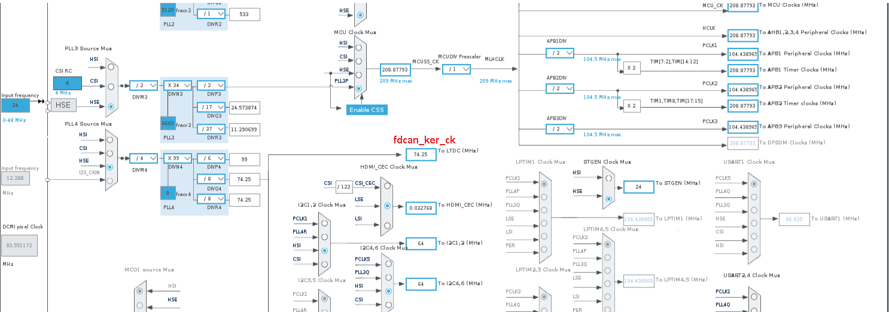

# stm32mp1-fdcan-init-explanation

These code snippets document an issue while clearing the FDCAN `CCCR.INIT` bit on STM32 devices using Bosch M_CAN/FDCAN controllers. See https://tinyurl.com/y2e2nmrk

The root cause in this case was an insufficient FDCAN kernel clock frequency (`fdcan_ker_ck` below 80 MHz). The repository also shows the PLL4_R clock setup and the INIT-to-RUN transition sequence.

This repository is $\color{red}{\textbf{not}}$ a standalone STM32CubeIDE project. It is a minimal extract from a working STM32MP1 Cortex-M4 bring-up environment and focuses only on the relevant FDCAN initialization path.

## Original CubeMX Clock Configuration with too low frequency

The screenshot below shows the original CubeMX clock configuration.

* Input clock: HSE = 24 MHz
* DIVM4 = 4
* DIVN4 = 99
* DIVQ4 = 8
* DIVR4 = 8

The resulting PLL4_R output frequency was:

`24 MHz / 4 * 99 / 8 = 74.25 MHz`

In this configuration the selected FDCAN kernel clock (`fdcan_ker_ck`) was only 74.25 MHz, which is below the required 80 MHz minimum for my controller.

## Working PLL4 Configuration

The working test code reconfigured PLL4 to:

* HSE = 24 MHz
* M = 3
* N = 124
* R = 4

Result:

`24 MHz / 3 * 124 / 4 = 248 MHz`

After increasing the PLL4_R output frequency above 80 MHz, the controller was able to leave INIT mode correctly.
